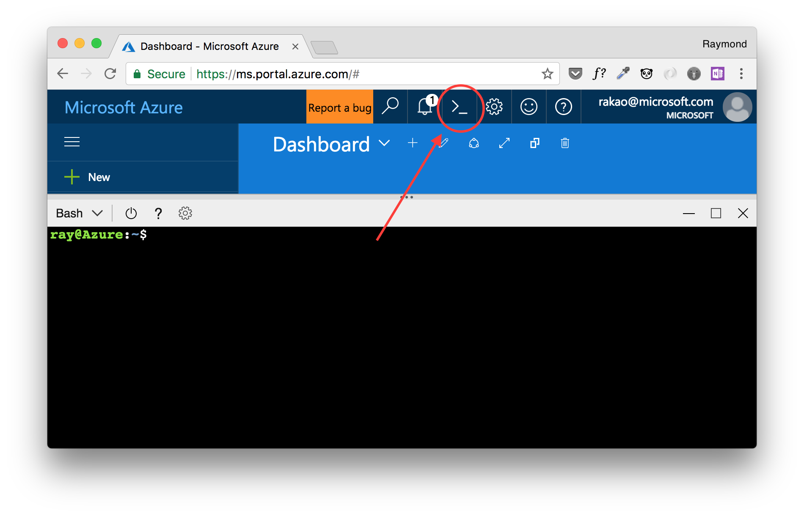

# Setting up your environment for the labs

## Expected Outcome
In this lab you will find the prerequisites and steps to help you set up your computer. After completing the lab you will have a working environment, ready for the other labs.

## Configure your computer

### Install Azure Command Line Interface (CLI)
#### If you are running Windows 10, you can install the Windows Subsystem for Linux by clicking [here](https://msdn.microsoft.com/en-us/commandline/wsl/install_guide).

To run these labs, **Azure CLI 2.0** is required. It can be downloaded and installed from [here](https://docs.microsoft.com/en-us/cli/azure/install-azure-cli?view=azure-cli-latest).

Check Azure CLI is working:
```bash
az --version
```

### Install Visual Studio Code

To run these labs, **Visual Studio Code** is required. It can be downloaded and installed from [here](https://code.visualstudio.com).

### Install Git

It should install as part of VS Code, but in case not install it from [here](https://git-scm.com).

Check git is working:
```bash
git --version
```

### Create Docker Build Machine

Using **Azure Cloud Shell** in the browser, We will use the ```docker-machine``` command to provision a VM to Azure and install the Docker engine on to it.  [**Note:** Azure Cloud Shell provisions a terminal session in Azure with many tools already installed including Azure-CLI, Docker, Docker-Machine and others.]  



This remote Docker host VM will be used to pull and push container images to a registry and build custom images from.  We do this by configuring our local Docker Environment variables (using ```eval $(docker-machine ...)```) to "point to" the remote Docker host VM.  This will allow us to type Docker commands from our local terminal, however the commands are actually executed remotely on the Docker host VM we create.

```bash
# Not needed for cloud shell - you're already logged in.
az login

# Create a new resource group to use (you could also reuse an existing group...just remember which one you use)
az group create \
    --name docker-machine-<alias>-rg \
    --location canadacentral

az account list

# Create the remote Docker host VM
docker-machine create \
    --driver azure \
    --azure-subscription-id <subscription_id> \
    --azure-image  "Canonical:UbuntuServer:14.04.5-LTS:latest" \
    --azure-size "Standard_D2_v2" \
    --azure-resource-group docker-machine-<alias>-rg \
    --azure-location canadacentral \
    docker-machine-<alias>

# This will execute the text that docker-machine env command generates
# it is a one time variable setup - it will not persist between terminal sessions
# you must run this command again the next time you login
eval $(docker-machine env docker-machine-<alias> --shell bash)
```

Install docker tools locally: 
- Docker for [Mac](https://docs.docker.com/docker-for-mac/)
- Docker for [Windows](https://docs.docker.com/docker-for-windows/)

### Create ACS Cluster

This section will take us through the steps of creating a new Container Cluster with Kubernetes as the Orchestrator using Azure Container Service, also known as ACS.

```bash
# Create Resource Group
az group create \
    --name acs<alias>-rg
    --location canadacentral

# Create Cluster Command.
az acs create --orchestrator-type kubernetes --resource-group acs<alias>-rg --name myK8sCluster-<alias> --generate-ssh-keys
```

### Clone or download content of this GitHub repository (optional but recommended)

The labs provided have a combination of text documentation and sample code. In order to have all documentation and all necessary sample files locally on your computer, we strongly recommend you to clone the repo.

## Summary

You have the latest version of Azure CLI, Visual Studio Code and Git installed on your computer along with a Docker Build Machine in Azure.
