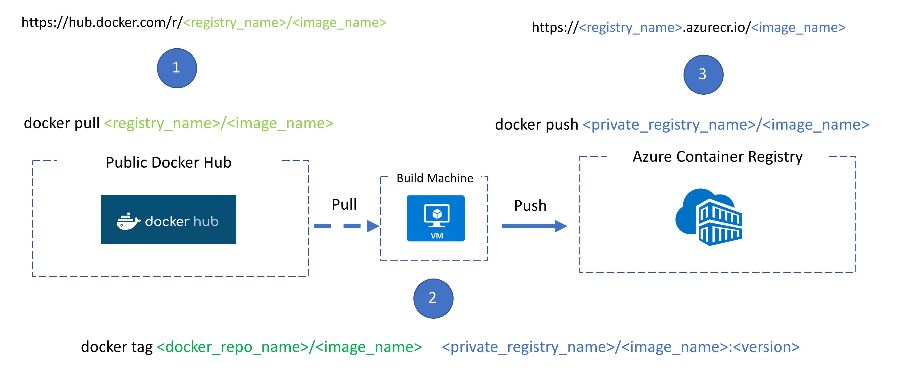

# Working with Web App for Containers

In this lab you will be working with Web App for Containers which is one of the easiest ways to get started with building Web or REST-based APIs with Containers.

## Deployment Methods:

### 1. Deploy Container via Portal
- link to ``kevingbb/bobble`` from Docker Hub (public image)

### 2. Deploy Container via CLI
- pull in ``kevingbb/bobble`` from Docker Hub (public image)
- create a new app service plan ```az appservice plan``` ... note: don't forget ```--is-linux``` flag
- now configure the app ```az webapp config```

### 3. Directly with Git
- Create new Web App using same App Service Plan
- Create new local web application using dotnet Core or Node or Python
- Create initialize a new Git Repo in command line
```:bash
    git init
    git add .
    git commit -m "Initial commit."
```
- Push local Git Repo to Web App service
```:bash
    git remote add ...
    git push ...
```

### 4. Private Registry (Azure Container Registry - ACR)
- Create an Azure Container Registry (ACR)
- Pull in a public image from docker hub
- Re-tag the public image and namespace it to your private registry (hint: <your-private-registry>.azurecr.io)
- Link your new ACR to your Web App for Containers Service (WACS)
    - You can do this in the portal or CLI
    - You can also enable Continuous Deployment when the ACR image is updated (pushed to ACR)



## Troubleshooting

Trouble shooting into the container is done through Kudu and the console Kudu provides.  This allows you to SSH into the container from Kudu web interface.  The container is otherwise inaccessible directly via SSH.

## Advanced:

1. Deploy Custom Container from Private Registry
2. Add SSH access to custom Container via Kudu
    **Hint:** Need to install SSH via Dockerfile and setup with a specific user
3. Implement Continuous Integration
    **Hint:** Leverage Blade in Portal
