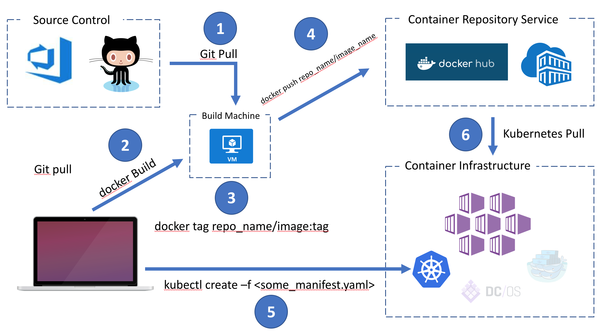

# Working with Azure Container Services Kubernetes

This lab provides an introduction to Docker along with Kubernetes. It also shows how to create a Kubernetes (K8s) Cluster using ACS along with how to deploy different types of workloads.

## 00 Pre-work

The purpose of this section is to help you get familar with Kubernetes on Azure. There are a couple of options, Azure Container Service (ACS) which allows for complete control of the environment, and our new Managed Kubernetes Service (AKS) which is in **PREVIEW**. We are going to focus on AKS as that is the future and allows us to focus on deploying ``Applications`` versus managing ``Infrastructure``.

- The first step is to create the Cluster.
- The second step is to connect to the Cluster.
- To make this easier, we are going to leverage the existing Tutorial in Azure Docs. Click [here](https://docs.microsoft.com/en-us/azure/aks/kubernetes-walkthrough) to navigate to the Docs.

## 1. Introduction to Kubernetes
- Click [here](https://katacoda.com/courses/kubernetes) and do the following exercises:
    - ``Deploy Containers Using Kubectl``

## 2. Create Container with Azure Container Instance (ACI)

The purpose of this section is similar to the Web App for Containers first challenge, show how easy it is to get started with Containers in Azure. The difference is that this is ACI which feels more like Serverless, and bills like Serverless, versus Web App for Containers which is PaaS.

- Spin up a Container using ACI via the az cli that is exposed via a Public IP. The az command you want to look at is **container**. A sample command should start with ``az container`` and then add the necessary parameters. One thing to keep in mind, pick a Web Application Image as we are gonig to expose it on a port so it needs to be HTTP accessible.

**Hint:** Click [here](https://docs.microsoft.com/en-us/azure/container-instances/container-instances-quickstart) if you are having difficulties.

## 3. Work with Already Created Cluster:

The purpose of this section is to help you understand how to deploy Containers to Managed Kubernetes Services (AKS), which you will realize is exactly the same as Azure Container Service (ACS) Kubernetes.

- Create Sample Application
    * Initially the EXTERNAL-IP for the azure-vote-front service appears as pending. Once the EXTERNAL-IP address has changed from pending to an IP address put that in your browser to test out the app.
```bash
# Run K8s File.
kubectl create -f azure-vote.yaml

# Test the App.
kubectl get service azure-vote-front --watch
```
- Cleanup Sample Application
    * Remove the Deployment from Kubernetes Cluster
```bash
# Delete the external facing front-end service.
kubectl delete svc azure-vote-front

# Run the Test line again to see what has changed.

# Delete the external facing back-end service.
kubectl delete svc azure-vote-back

# Delete the deployment.
kubectl delete deploy azure-vote-front
```

## 4. Take a Step Back and Understand Pods, Services & Deployments in Kubernetes

The purpose of this section is to help you understand a couple of the key building blocks when it comes to deploying Containers in Kubernetes. There are sample files in this directoy to help you out with the following challenges.

- Create a Pod manifest file that has the following parameters [pod.yaml](pod.yaml):
    * Uses 2 Labels zone = prod and version = v1
    * Uses the evillgenius\kuar:1 image
    * Exposes port 8080
    * Verify Pod is operational by using ``kubectl port-forward`` command to forward port 8080 on your local host to port 8080 on the pod and checking with you browser ``http://localhost:8080``
- Create a Deployment manifest using the same parameters as above but add [deploy.yaml](deploy.yaml):
    * You will need to replace ``<APP_NAME_GOES_HERE>``
    * Make 3 replicas of the app
    * Use a RollingUpdate strategy with no less than 1 pod avaialble and no more than 1 pod extra during updates
    * Verify deployment is operational by using ``kubectl port-forward`` command to forward port 8080 on your local host to port 8080 on any of the pods in the deployment and checking with you browser ``http://localhost:8080``
- Create a Service manifest that exposes the Deployment above using a LoadBalancer [service.yaml](service.yaml):
    * **Hint:** You need to link the Service and Deployment together.
    * **Note:** Getting an external IP may take some time initially. use ``kubectl get service -w`` until an external IP is shown.
    * Test Container via Public IP
- Combine the Deployment Manifest and the Service Manifest yaml files into a **single** Kubernetes Manifest yaml file ([example](kubernetes-manifest-example.yaml)]and deploy it into a new Namespace
    - **Hint:** Take a look at the [azure-vote.yaml](azure-vote.yaml) file that was used to deploy the full application.

## Troubleshooting

### Unable to connect to your cluster:
- Some versions of Azure-CLI will not pull down your kube config file properly
- you must pull it down manually:

```:bash
# go to your ~/.kube folder
cd ~/.kube

# copy the remote config file to your local ~/.kube folder
scp -i /path/to/your/ssh/key <your_kube_user>@<kube_cluster_master_name>.<azure_location>.cloudapp.azure.com:~/.kube/config ~/.kube

# example
scp -i ~/.ssh/id_rsa azureuser@rkk8sclust-resourcegroup-uuid.canadacentral.cloudapp.azure.com.canadacentral.cloudapp.azure.com:~/.kube/config ~/.kube
```

## Advanced:

1. Add ACI Node to existing K8s Cluster and run a workload on it.
    - **Hint:** Click [here](https://docs.microsoft.com/en-us/azure/container-instances/container-instances-orchestrator-relationship#sample-implementation-azure-container-instances-connector-for-kubernetes) and go to **Sample Implementation** section at the bottom.
2. Replace LoadBalancer setup in yaml file with Ingress Controller.
    - **Hint:** Click [here](https://docs.microsoft.com/en-us/azure/aks/kubernetes-helm) for a hint.
3. Build a container image from scratch
    - Pull in code from a git repository
    - Add/Copy the code into your container via in a dockerfile
    - Build a new image
    - Push the new image to a Container Registry
    - Deploy the new container via K8s

